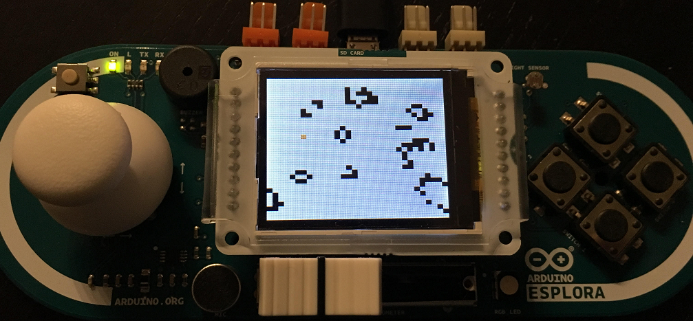

# Arduino Esplora Game Of Life

[Arduino Project Hub Page](https://create.arduino.cc/projecthub/imagile/conway-s-game-of-life-79bb05)

## Introduction
This project is a Conway's Game of Life implementation for Arduino Esplora + LCD Screen. The application is quite interactive, as you can see in the instructions below.

The project was developed using Arduino IDE 1.8.5.

To install the application, simply compile the Sketch and upload to your Esplora with LCD screen plugged in the frontal interface.

## Hardware
The only hardware used in this project were:
* Arduino Esplora: https://store.arduino.cc/arduino-esplora
* Ardiono LCD Screen: https://store.arduino.cc/arduino-lcd-screen

## Using the application

### TOP BUTTON (RANDOMIZE)
Use the TOP BUTTON to create a random state for the application.

### SLIDER (PROPORTION)
When a new random state is created, the slider is used to define the proportion of alive and dead cells. The more to right the slider is, the more alive cells are created.

### LEFT BUTTON (NEXT)
The LEFT BUTTON transitions the application to the next state, using the rules described above.

### BOTTOM BUTTON (PLAY)
Press this button to make the application automatically transition from one state to the other, until another button is pressed.

### RIGHT BUTTON (STOP)
Stops the automatic transition

### JOYSTICK (MOVE, CHANGE STATE)
Use the joystick to move the cursor across the grid. Click the joystick to invert the state of the cell the cursor is currently on top of.

## Feedback?

I appreciate feedback of any kind. Just give a message or post in issues. Thanks!
